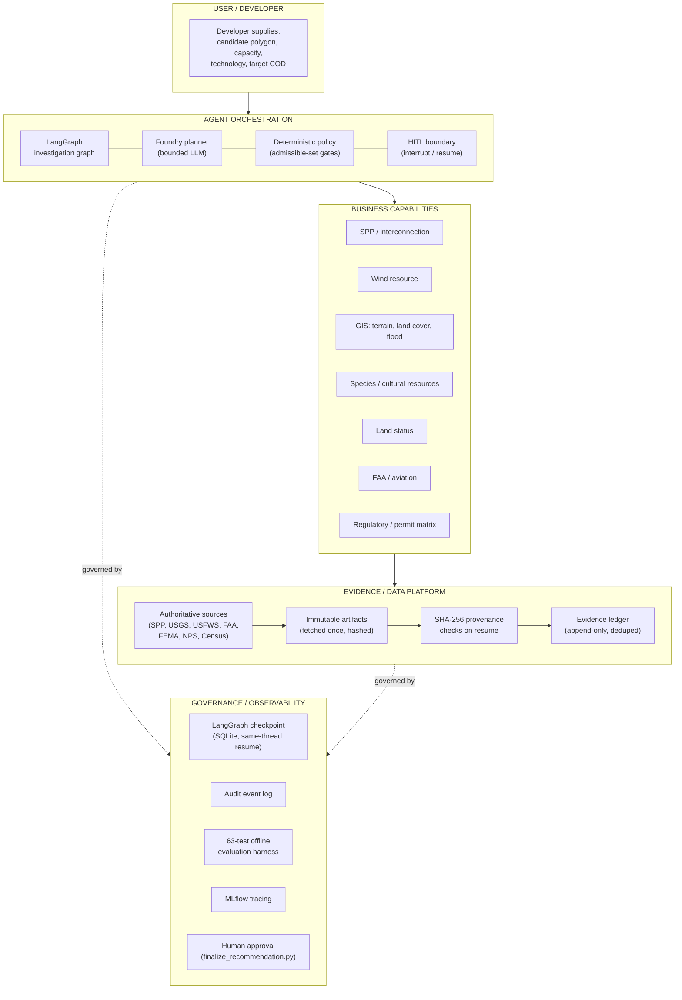
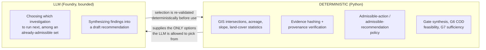
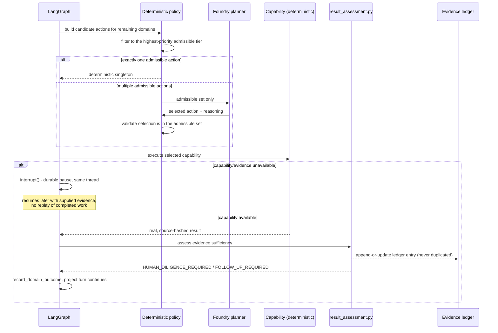

# Architecture Overview

## System shape: four layers

**Read it as a stack, not a pipeline.** Layer 1 orchestrates; Layer 2 does the
work Layer 1 decided was worth doing; Layer 3 is what Layer 2 actually reads
and writes; Layer 4 wraps all three in checkpointing, an audit trail,
regression tests, tracing, and a human approval gate that no other layer can
bypass.

---

## The one design decision that matters most

**Deterministic computation vs. LLM reasoning are never the same code path.**

The LLM never decides *what it is allowed to do*. It reasons inside a
window the deterministic layer already computed, and its output is
re-validated against that same window before anything downstream trusts it.
This pattern is used **twice** in the codebase, for two different decisions:

| Decision | Deterministic policy | Bounded LLM call |
|---|---|---|
| Which investigation to run next | `planner_policy.build_admissible_actions` | `foundry_planner.plan_follow_up` / `plan_project_investigation` |
| What recommendation category is defensible | `recommendation_policy.determine_allowed_categories` | `recommendation_drafter.draft_recommendation` |

If there is exactly one admissible option, the LLM is never called
(`PLANNER_BYPASSED_SINGLETON` / deterministic singleton path) — this isn't a
cost optimization, it's a correctness one: a choice with only one legal
answer should never depend on a model's judgment.

---

## Investigation lifecycle (per project turn)

---

## Post-investigation synthesis

Once every queued domain has at least one completed investigation, a
separate synthesis pass (not more investigation) turns ten domain-level
results into one project-level answer:

```mermaid
flowchart LR
    H["10 domain<br/>investigations<br/>(EXECUTED)"] --> GS["Gate synthesis<br/>G1-G5<br/>(reads real finding/checks<br/>data, not just status string)"]
    GS --> G6["G6<br/>COD feasibility<br/>(only 2 cited durations;<br/>everything else UNRESOLVED)"]
    G6 --> G7["G7<br/>Evidence sufficiency<br/>(SUFFICIENT_FOR_SCREENING<br/>≠ sufficient for ADVANCE)"]
    G7 --> RP["Recommendation policy<br/>(admissible-set: which of the<br/>4 categories are even legal)"]
    RP --> RD["Foundry draft<br/>(bounded to that set)"]
    RD --> HITL2["DRAFT_PENDING_HUMAN_REVIEW<br/>human_approved: false"]
    HITL2 --> FIN["finalize_recommendation.py<br/>(only code path that can<br/>set human_approved: true)"]
```

**`EXECUTED` is not `RESOLVED`.** Every one of the ten domains in the
current run resolved to `HUMAN_DILIGENCE_REQUIRED` — the investigation
succeeded, but the underlying business question (is this land legally
available, is this species risk manageable, is this route constructible)
remains open. The gate synthesis layer reads each domain's actual `finding`/
`checks` dict — not just that coarse status string — to extract real,
severity-rated material risks before a gate is allowed to read as
`CONDITIONALLY_SATISFIED`.

---

## Where things live

| Concern | Code |
|---|---|
| Graph state machine | `src/renewable_intelligence/graph/investigation_graph.py` |
| Business-fact -> risk extraction | `src/renewable_intelligence/graph/result_assessment.py` |
| Admissible-action / admissible-recommendation policy | `src/renewable_intelligence/agents/planner_policy.py`, `src/renewable_intelligence/synthesis/recommendation_policy.py` |
| Bounded LLM calls | `src/renewable_intelligence/agents/foundry_planner.py`, `src/renewable_intelligence/synthesis/recommendation_drafter.py` |
| Deterministic capabilities | `src/renewable_intelligence/{land,environmental,gis,regulatory,aviation,resource,transmission,interconnection}/` |
| Gate / schedule / sufficiency synthesis | `src/renewable_intelligence/synthesis/` |
| Human finalization (the only `human_approved: true` path) | `src/renewable_intelligence/synthesis/human_review.py` |
| Checkpointing (thread resume, no replay) | `src/renewable_intelligence/persistence/checkpointing.py` |
| Evaluation harness (63 tests, offline) | `tests/unit/`, `tests/integration/`, `tests/evaluation/` |
| Live-source drift check (not CI-gated) | `scripts/smoke_live_sources.py` |
| Full-pipeline trace | `scripts/trace_project_run.py` |

## Non-negotiables (enforced, not just documented)

- The LLM cannot invent an action, capability, or recommendation category —
  every choice is validated against a deterministic admissible set, and an
  out-of-set selection raises rather than silently clamping.
- The LLM-facing recommendation schema (`RecommendationDraft`) has no
  `human_approved` field. There is no code path by which a model call can
  finalize a recommendation.
- Every capability reads governed evidence by path + SHA-256 hash, verified
  at resume time — not by re-fetching from the network mid-graph.
- Absence of data is never silently treated as a favorable finding (FEMA:
  0% digital coverage is reported as `UNKNOWN`, not "no flood risk").
